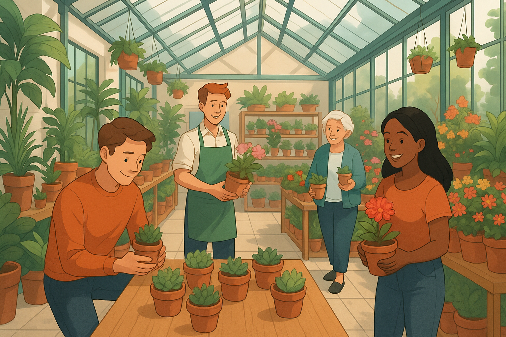
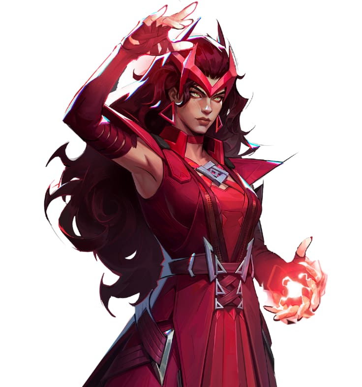

# COS 214 Project - Plant Nursery Simulator



# Contents

- [Description](#description)
- [Documentation and UML diagrams](#documentation)
- [Setup](#setup)
- [Team](#team)

# Description

The Plant Nursery Simulator is a C++ project that models the operations of a lively springtime nursery — from growing plants in the greenhouse to assisting customers on the sales floor.
It uses object-oriented design and software design patterns to manage plant care, customer interactions, and staff coordination.
The goal is to show how structured design brings order and flexibility to a complex, evolving system.

# Documentation

<!--[Report](Documents/City_Development_Report.pdf)

[Doxygen Documentation](Documents/Doxygen/)-->

[UML Diagrams](UML/)

# Setup

### Prerequisites

### Cloning

```
https://github.com/karishma0815/Abstract-Avengers.git
```

### Building

This project can be built using Makefile:

``` 
Compilation: make (Ensure you are currently in the SystemFiles directory)
Demo Main: make run 
Testing Main (Unit Tests): make test-<test_filename>
```

### Demo Running

<!--When make run_demo is called:

1. Go to Project/DataFiles/
2. Launch the web interface(index.html)
3. Console should say client connected(if not refresh html page)
4. Click play button to run the Simulation.
5. Click stop button to stop Simulation.
6. Wait for simulation to stop sending data.
7. Refresh html to terminate program.-->

# Team

<table>
    <tr><th>Member</th><th>Roles</th><th>Avenger</th></tr>
    <tr>
      <td align="center">
        Taskeen Abdoola<br>u22698681<br>
      </td>
      <td align="center">
        The Customers & The Sales Floor: <br>Builder<br>Decorator<br>Adapter<br>State<br>
      </td>
      <td>
        
      </td>
    </tr>
    <tr>
      <td align="center">
        Sabira Karie<br>u23591481<br>
      </td>
      <td align="center">
        The Customers & The Sales Floor:
        <br>Command<br>Iterator<br>Strategy<br>
      </td>
      <td>
        
      </td>
    </tr>
    <tr>
      <td align="center">
        Karishma Boodhoo<br>u23538199<br>
      </td>
      <td align="center">
        The Staff:
        <br>Command<br>Chain of Responsibility<br>Mediator<br>Factory Method<br>
      </td>
      <td>
        
      </td>
    </tr>
    <tr>
      <td align="center">
        Rene Reddy<br>u23558572<br>
      </td>
      <td align="center">
        Greenhouse/Garden Area:
        <br>State<br>
      </td>
      <td>
        
      </td>
    </tr>
    <tr>
      <td align="center">
        Kiolin Gounden<br>u22647300<br>
      </td>
      <td align="center">
        Greenhouse/Garden Area:
        <br>Factory Method<br>Observer<br>Composite<br>
      </td>
      <td>
        
      </td>
    </tr>
</table>
